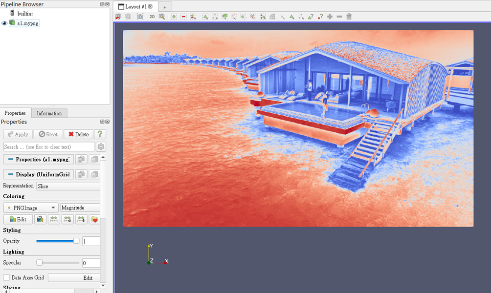

# MyPNG Reader
## 介紹:
我們做了一個可以讀特定檔案的reader plugin，將編譯好的plugin匯入進paraview後， 就可以打開.mypng的檔案。
## 檔案格式:
- MyPNGReader
    - CMakeLists.txt
    - Plugin
        - CMakeLists.txt
        - MyPNGReaderPlugin.cxx
        - MyPNGReader.h
        - MyPNGReader_qch.h
## 成果
