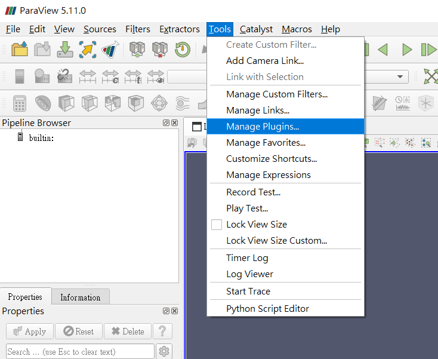

# Paraview Plugin
## 介紹: 
 * 增加新的讀取器(reader)、寫入器(writer)和過濾器(filter)：Paraview插件機制允許開發人員添加自定義的功能，如支持新的文件格式、整合新的過濾器等。通過撰寫插件，可以擴展Paraview的功能範圍，並滿足特定需求。

 * 自定義GUI組件：插件可以添加自定義的GUI組件，例如工具欄按鈕，用於執行常見任務。這樣可以增強Paraview的用戶界面，使其更適應特定的工作流程和需求。

 * 添加新的視圖：Paraview插件機制允許開發人員添加新的視圖來顯示數據。通過撰寫插件，可以創建針對特定數據類型或領域的定制化視圖，提供更好的數據可視化和分析能力。

 * 插件分類：Paraview插件可以分為服務器端插件和客戶端插件。服務器端插件用於擴展ParaView的算法功能，例如新的過濾器、讀取器和寫入器，而客戶端插件用於擴展ParaView的用戶界面，例如自定義屬性面板、工具欄和視圖。某些插件同時具有服務器端和客戶端組件，需要在服務器和客戶端上加載。

插件加載方式：可以通過Tools中的Manage Plugins來加載插件。

## 建置步驟:
要創建Paraview插件的相關文件並執行相應的步驟，可以按照以下教學進行操作：

 * 創建客戶端文件（Reader.xml）：首先，創建一個名為"Reader.xml"的客戶端文件。這個文件將用於在Paraview中定義你的插件。根據你的需求，你可以使用XML或JSON格式來定義插件的屬性，包括名稱、類型、文件格式、參數等等。

 * 創建服務器端文件：在服務器端，你需要創建一些自定義的C++文件來處理導入的數據。這些文件將被編譯並生成可供Paraview使用的庫文件。

 * 文件樹：根據你的插件需求，創建一個文件樹結構。這個結構可以包括源代碼文件、頭文件、依賴庫文件等。確保你的文件結構清晰，符合Paraview插件開發的要求。

 * 編譯文件：使用適當的編譯工具和命令，將你的自定義C++文件編譯為庫文件。具體的編譯過程可能因操作系統和開發環境而異。確保你的編譯過程順利且沒有錯誤。

 * 導入編譯後的文件：將編譯生成的庫文件（通常是*.so或*.dll格式）導入Paraview中。這可以通過在Paraview中添加插件的方式進行。確保你按照Paraview的相應文檔或界面指南進行操作，將庫文件成功導入

 ## 主要文件介紹  
 
 * .h 文件：.h 文件包含了class、function和variable的聲明，它們描述了這些實體的接口和功能，但不包含具體的實現細節。這些聲明允許其他源文件引用和使用這些實體。.h 文件通常用於定義類的接口、函數原型、常量和類型定義等。
  * .cxx 文件：cxx 文件則包含了對類、函數和變量的具體實現。它們包含了詳細的代碼，實現了在 .h 文件中聲明的功能。.cxx 文件包含了函數的定義、變量的初始化等。.cxx 文件實際上是在頭文件中聲明的實體的實現部分。通常，在 .cxx 文件的開頭會使用 #include 指令將相應的 .h 文件包含進來。這樣可以將 .h 文件中聲明的類、函數和變量引入到 .cxx 文件中，以便在其中使用和實現。

 * CMakeLists.txt 文件：CMakeLists.txt 文件是使用 CMake 工具的配置文件。CMake 是一個跨平台的開源構建工具，用於管理 C++ 項目的編譯過程。在 Paraview 插件開發中，將使用 CMakeLists.txt 文件來配置和管理插件項目的編譯過程。
 * XML 文件：XML（可擴展標記語言）文件用於定義 Paraview 插件的屬性、外觀和配置信息。XML 文件描述了插件的名稱、類型、參數、選項和界面等。它還可以包含對應的 C++ 代碼和庫文件的引用。XML 文件在 Paraview 中用於解析和註冊插件，並提供用戶界面來設置插件的參數和操作。開發者需要根據插件的需求編寫和配置相應的 XML 文件。

