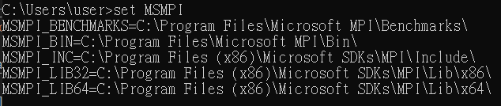
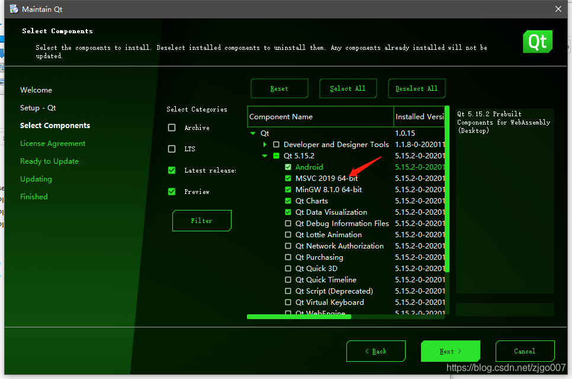
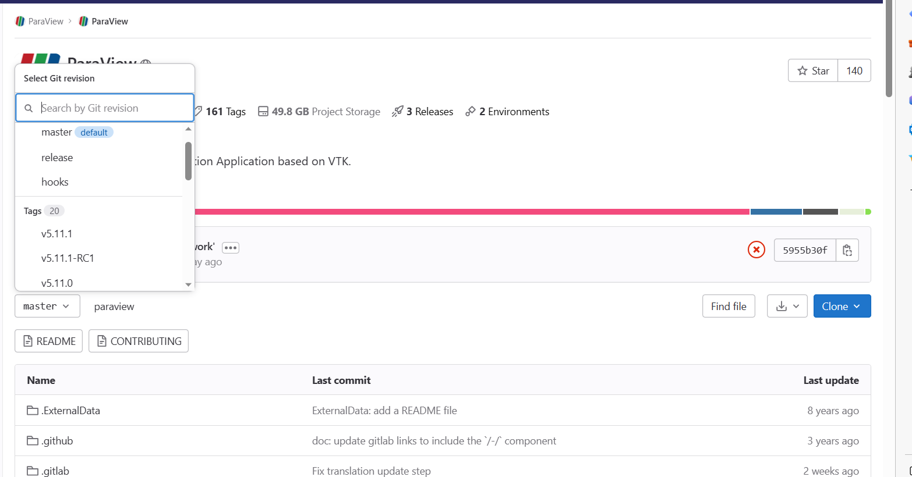
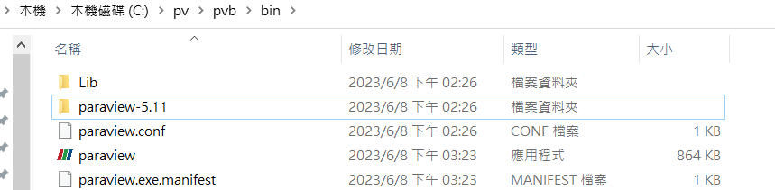

# Building ParaView
遮個部分介紹如何下載及安裝Paraview，building的過程我們主要參考官方的說明[BuildingParaView](https://github.com/Kitware/ParaView/blob/master/Documentation/dev/build.md)，支援Linux (x86_64), Windows (x86_64) and macOS (x86_64 and arm64)，我們實際安裝的是macOS及Windows:

## 準備工作
這段的安裝教學可以幫助從未構建過 ParaView、沒有一般編譯經驗或不知道在構建 ParaView 時可能需要哪個選項的人。以下是我們的安裝過程
[macOS版本](#macOS),  
[Windows版本](#Windows),  
### macOS
#### 可能遇到的問題

### Windows
1. 環境:  
 * 下載並安裝[git bash for windows][gitforwindows]
 * 下載並安裝 [cmake][cmake-download]
 * 下載並安裝 [Visual Studio 2019 Community Edition][visual-studio]
 * 下載 [ninja-build][ninja] 然後將`ninja.exe` 放進`C:\Windows\`
 * 從[Microsoft MPI][msmpi]下載並安裝`msmpisetup.exe` 跟`msmpisdk.msi`  
 我下載的是10.1.1的版本，安裝完畢後輸入  
 ```sh
set MSMPI
```
 會顯示安裝好之後的幾個環境變量
 * 下載並安裝 [Python for Windows][pythonwindows], 添加路徑到 `PATH`的環境變數.
 * 下載並安裝Windows版本的 [Qt 5.15.2][qt-download-5.15.2], 0安裝的時候選擇MSVC 2019 64-bit 的選項
 .
    * 然後添加 `C:\Qt\5.15.2\msvc2019_64\bin` 到`PATH` 環境變數.
2. 建置  
Paraview有分許多版本可以下載

 * 打開 git bash
 * 如果要build的不是特定版本，預設為master:

```sh
cd C:
mkdir pv
cd pv
git clone --recursive https://gitlab.kitware.com/paraview/paraview.git
mv paraview pv
mkdir pvb
```

 * 如果要執行特定版本, eg: v5.9.1，執行下列指令並把 "tag"換成所要下載的版本，我下載的是5.11.0

```sh
cd C:
mkdir pv
cd pv
git clone https://gitlab.kitware.com/paraview/paraview.git
mv paraview pv
mkdir pvb
cd pv
git checkout tag
git submodule update --init --recursive
```
#### 執行

直接進入bin資料夾執行paraview.exe或在terminal輸入

```sh
./bin/paraview
```


[cmake-download]: https://cmake.org/download
[cmake]: https://cmake.org
[ffmpeg]: https://ffmpeg.org
[git]: https://git-scm.org
[gitforwindows]: https://gitforwindows.org/
[mesa]: https://www.mesa3d.org
[mpi]: https://www.mcs.anl.gov/research/projects/mpi
[mpich]: https://www.mpich.org
[msmpi]: https://docs.microsoft.com/en-us/message-passing-interface/microsoft-mpi
[ninja]: https://github.com/ninja-build/ninja/releases
[nvpipe]: https://github.com/NVIDIA/NvPipe
[openmpi]: https://www.open-mpi.org
[paraview-issues]: https://gitlab.kitware.com/paraview/paraview/-/issues
[python]: https://python.org
[pythonwindows]: https://www.python.org/downloads/windows/
[qt-download]: https://download.qt.io/official_releases/qt
[qt]: https://qt.io
[qt-download-5.15.2]: https://download.qt.io/archive/qt/5.15/5.15.2/
