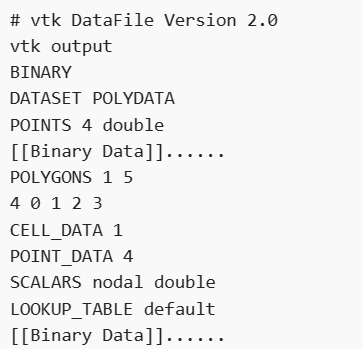
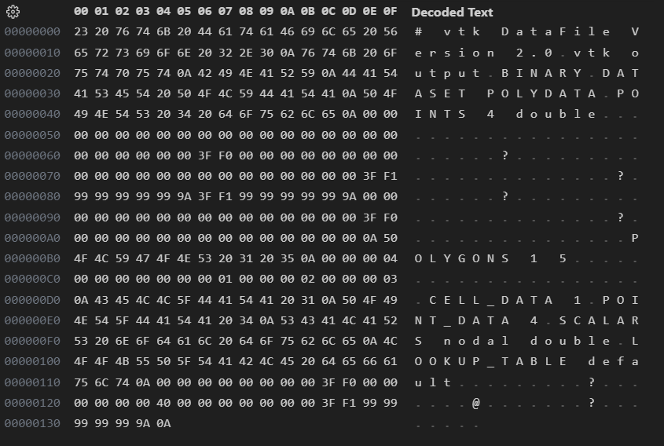
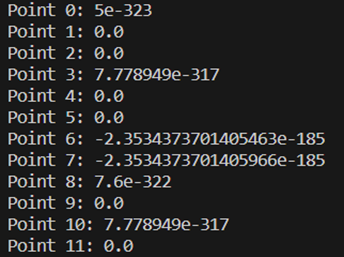
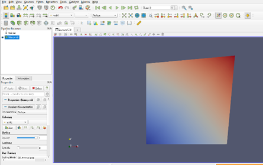

# 介紹:
## binary.vtk
因為我們最開始的資料集大部分都是.vtk的3D科學資料的圖片檔，因此我們也有做一些有關vtk檔案的範例可以參考，我們了解到要能夠讓Paraview讀取的vtk檔可以用binary或是ASCII撰寫，且需要依照一定的格式，包含File Version and Identifier、參考網路上的[vtk檔案](https://discourse.paraview.org/t/writing-and-reading-binary-vtk-file/3981)，使用python讀取各點資料並匯入Paraview。  
binary.vtk依照下面的格式:  
  
我在VScode中使用Hex editor 打開

## point.py:
這段程式碼使用了Python的base64和struct模塊來對編碼的base64字符串進行解碼和解析。它通過將base64字符串解碼為原始的二進制數據，然後使用struct.unpack()函數將二進制數據解析為double類型的數值。這段程式碼只有展示如何解析二進制數據並求出其中的坐標值，它並沒有直接涉及VTK庫或VTK檔案的操作。如果要使用VTK庫來處理VTK檔案，可以使用VTK庫提供的相應函數和類來讀取和操作VTK檔案。

匯入Paraview後的呈現
